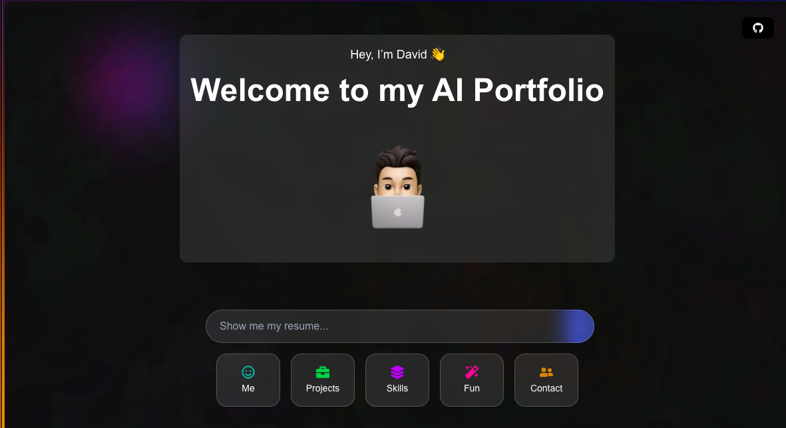

<p align="center">
  
  <h2 align="center">David Geddam's AI Portfolio</h2>
  <p align="center">An interactive, AI-powered portfolio showcasing projects, skills, and experience through a conversational UI.</p>
</p>

<p align="center">
  
  
  
  
  
  
</p>

<p align="center">
  <a href="https://ai-portfolio-hazel-phi.vercel.app/">View Live Site</a> ·
  <a href="https://github.com/dave21-py/ai-portfolio/issues/new?labels=bug&template=bug_report.md">Report Bug</a> ·
  <a href="https://github.com/dave21-py/ai-portfolio/issues/new?labels=enhancement&template=feature_request.md">Request Feature</a>
</p>

---

## ✨ Overview

This repository powers my personal AI-native portfolio. Built from the ground up with **Next.js**, **TypeScript**, and **Tailwind CSS**, it moves beyond traditional static sites by offering an interactive, conversational experience.

The core of the portfolio is a chatbot interface that allows visitors to ask for specific information, which then dynamically displays the relevant content in beautifully animated modals.

*   **Conversational UI:** Engage with an AI assistant to navigate through different sections like skills, projects, and experience.
*   **Interactive Background:** A dynamic, fluid WebGL background that responds to cursor movements, built with `webgl-fluid`.
*   **Smooth Animations:** Seamless page transitions and modal animations powered by **Framer Motion**.
*   **Fully Responsive:** A clean, modern design that looks great on all devices.
*   **Easily Extensible:** A component-based architecture that makes adding new sections straightforward.

---

## 🚀 Getting Started

To get a local copy up and running, follow these simple steps.

### Prerequisites

*   Node.js (v18 or later)
*   npm

### Installation

1.  **Clone the repo**
    ```bash
    git clone https://github.com/dave21-py/ai-portfolio.git
    ```
2.  **Navigate to the project directory**
    ```bash
    cd ai-portfolio/my-ai-portfolio
    ```
3.  **Install NPM packages**
    ```bash
    npm install
    ```
4.  **Set up environment variables**
    Create a `.env.local` file in the `my-ai-portfolio` directory and add any necessary API keys.
    ```
    HF_TOKEN=your_hugging_face_api_key_here
    ```
5.  **Run the development server**
    ```bash
    npm run dev
    ```
    Open [http://localhost:3000](http://localhost:3000) with your browser to see the result.

---

## 🛠️ Tech Stack

*   **Framework:** [Next.js](https://nextjs.org/)
*   **Language:** [TypeScript](https://www.typescriptlang.org/)
*   **Styling:** [Tailwind CSS](https://tailwindcss.com/)
*   **Animation:** [Framer Motion](https://www.framer.com/motion/)
*   **Graphics:** [webgl-fluid](https://github.com/PavelDoGreat/WebGL-Fluid-Simulation)
*   **Deployment:** [Vercel](https://vercel.com/)

---

## 📂 Folder Structure

The project uses the Next.js App Router structure:

-   `my-ai-portfolio/`
    -   `app/`
        -   `page.tsx`: The main entry point and layout for the portfolio.
        -   `layout.tsx`: The root layout of the application.
        -   `globals.css`: Global styles managed by Tailwind CSS.
        -   `[Component].tsx`: All modal components (e.g., `Skills.tsx`, `Experience.tsx`) and UI components (`ChatInput.tsx`).
    -   `public/`: Contains all static assets like images, logos, and your resume PDF.

---

## 🌐 Deployment

This portfolio is deployed on **Vercel**. Any push to the `main` branch will automatically trigger a new deployment, ensuring the live site is always up-to-date with the latest changes.

---

## 🙌 Contributing

Contributions, issues, and feature requests are welcome! Feel free to check the [issues page](https://github.com/dave21-py/ai-portfolio/issues).
